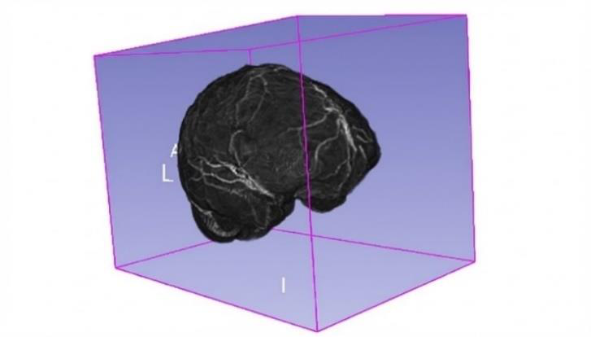
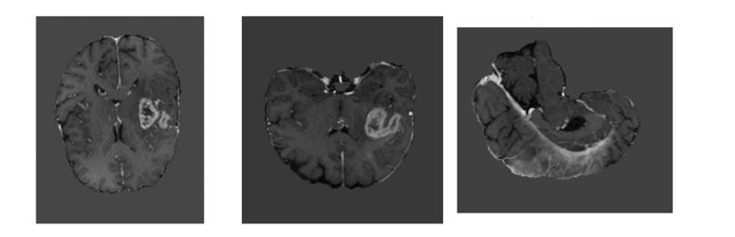
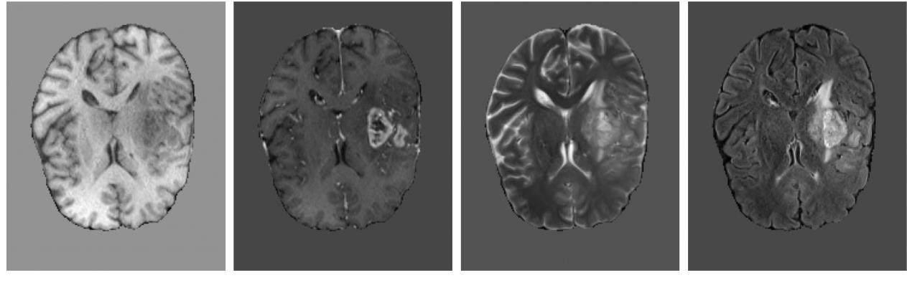
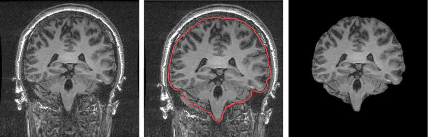
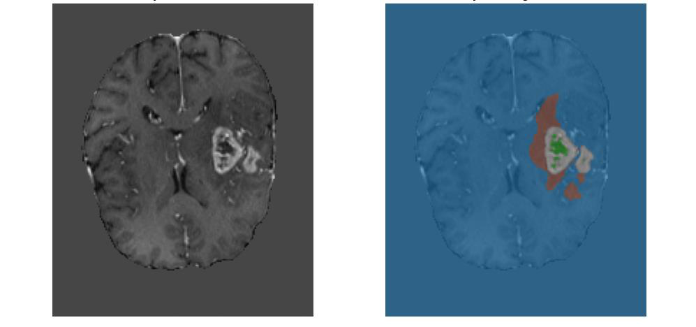
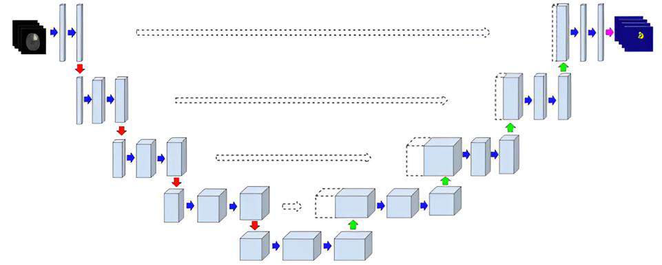
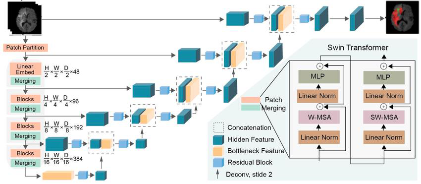
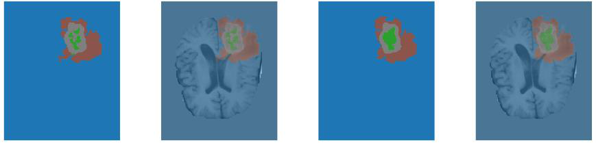
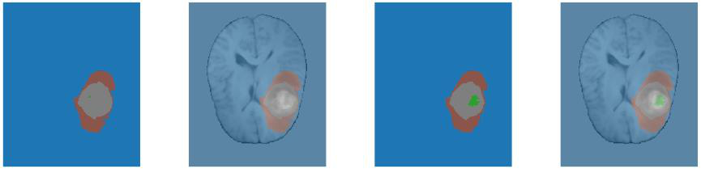
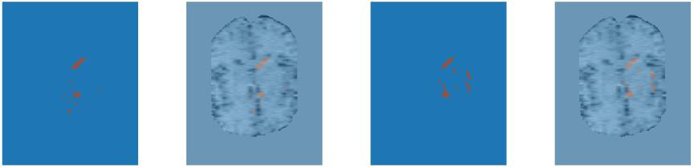

# BrainChallenge

**3D glioma segmentation on multiparametric MRI (BraTS)**

PyTorch / MONAI pipeline for volumetric segmentation of adult gliomas. The project was developed as part of a BSc thesis in *Philosophy and Artificial Intelligence* (Sapienza University of Rome, A.Y. 2024–2025): *From CNNs to Transformers: a systematic evaluation of automatic segmentation methods for brain gliomas*.

This repository implements the **3D U-Net** training and evaluation stack used in that study (patch-based training, class-weighted DiceCE loss, Dice and HD95 on BraTS composite regions).

---

## Motivation

Gliomas account for a large share of primary malignant brain tumours. Accurate delineation of tumour subregions on MRI supports surgical planning, radiotherapy targeting, treatment-response assessment, and quantitative imaging biomarkers. Manual slice-by-slice annotation is slow and observer-dependent. Automatic 3D segmentation is therefore a core problem in neuro-oncology imaging.

The work uses the **BraTS** (Brain Tumor Segmentation) benchmark: multi-institutional, skull-stripped, co-registered mpMRI with expert consensus labels.

<p align="center">
  
</p>
<p align="center"><em>Figure. Example pre-operative BraTS volume in 3D (3D Slicer).</em></p>

## Task

Volumes are 3D NIfTI grids, typically inspected on axial, coronal and sagittal planes:

<p align="center">
  
</p>

Given four co-registered MRI sequences per patient:

<p align="center">
  
</p>
<p align="center"><em>Figure. Same axial slice: T1, T1 with gadolinium, T2, FLAIR.</em></p>

| Sequence | Role |
| --- | --- |
| T1 native | Anatomy |
| T1Gd / T1ce | Active (enhancing) tumour |
| T2 | Necrosis, cysts, fluid |
| FLAIR | Peritumoral edema / infiltration |

Official BraTS preprocessing (already applied to the public data) includes co-registration, 1 mm³ resampling and skull stripping:

<p align="center">
  
</p>

The model predicts voxel-wise labels:

| Label | Name | Description |
| --- | --- | --- |
| 0 | Background | Non-tumour tissue |
| 1 | NETC | Non-enhancing tumour core (necrosis / non-enhancing core) |
| 2 | SNFH | Surrounding non-enhancing FLAIR hyperintensity (edema / infiltration) |
| 3 | ET | Enhancing tumour |

Evaluation follows BraTS composite regions:

- **ET** — enhancing tumour  
- **TC** (tumour core) = ET + NETC  
- **WT** (whole tumour) = ET + NETC + SNFH  

<p align="center">
  
</p>
<p align="center"><em>Figure. T1ce (left) and overlay (right): NETC, SNFH, ET.</em></p>

Metrics: **Dice Similarity Coefficient (DSC)** and **95th-percentile Hausdorff distance (HD95)**.

## Method (this repository)

<p align="center">
  
</p>
<p align="center"><em>Figure. 3D U-Net encoder–decoder with skip connections (thesis, adapted from Aboussaleh et al., 2024).</em></p>

- **Architecture:** 3D U-Net encoder–decoder with skip connections, 3×3×3 convolutions, batch normalisation, ReLU, and Dropout3D in the bottleneck and decoder (`dropout_rate = 0.3` by default).
- **Input:** 4-channel 3D volumes; **z-score** normalisation on brain voxels only (background excluded).
- **Training:** random **128³** patches; ~70% sampled on tumour, ~30% random; optional MONAI geometric / intensity augmentation.
- **Imbalance:** inverse-frequency **class weights** in DiceCE loss (Dice + cross-entropy, λ = 0.5 / 0.5).
- **Optimisation:** Adam (`lr = 1e-4`), `ReduceLROnPlateau`, gradient clipping, early stopping on validation loss.
- **Inference:** sliding-window evaluation on full volumes (ROI 128³, overlap 0.5), then trilinear resampling to the label grid.

Thesis experiments also compared this CNN to **Swin UNETR** (hybrid Transformer encoder + convolutional decoder). That comparison is documented in the Results section; the public code here is the modular 3D U-Net pipeline.

<p align="center">
  
</p>
<p align="center"><em>Figure. Swin UNETR: shifted-window Transformer encoder and CNN decoder (adapted from Mavridis et al., 2024).</em></p>

## Results (thesis experiments)

Dataset: **1,251** pre-operative BraTS glioma cases, split **70 / 20 / 10** (train / validation / test). Training used 128³ patches for up to 200 epochs (early stopping patience 20). Below: mean Dice and HD95.

### Baseline (no augmentation)

| Model | Dice ET | Dice WT | Dice TC | HD95 ET | HD95 WT | HD95 TC |
| --- | ---: | ---: | ---: | ---: | ---: | ---: |
| 3D U-Net | 0.824 | 0.871 | 0.872 | 4.174 | 13.390 | 5.210 |
| Swin UNETR | 0.834 | 0.897 | 0.887 | 5.762 | 14.495 | 7.393 |

Swin UNETR improved **whole-tumour** overlap (statistically significant). Contour error (HD95) was often better for the CNN on ET/TC at baseline.

### With regularisation and data augmentation

| Model | Dice ET | Dice WT | Dice TC | HD95 ET | HD95 WT | HD95 TC |
| --- | ---: | ---: | ---: | ---: | ---: | ---: |
| 3D U-Net + aug. | 0.833 | 0.891 | 0.877 | 3.688 | 9.609 | 4.340 |
| Swin UNETR + aug. | 0.841 | 0.898 | 0.890 | 3.232 | 9.530 | 4.666 |

After augmentation, Dice scores **converge**; remaining WT Dice difference is small. HD95 drops for both models (better boundaries). Parameter count: about **5.6M** (3D U-Net) vs **16M** (Swin UNETR), with roughly **2×** training time for the Transformer.

**Takeaway:** volumetric Transformers help on large, diffuse WT; a regularised 3D U-Net remains competitive on local ET/TC and is cheaper. Gains are not automatic from “more global attention” alone—augmentation and region of interest matter.

Typical remaining failure modes (qualitative), left-to-right in each strip: ground truth, GT overlay, prediction, prediction overlay. ET in green, NETC in grey, SNFH in brown.

<p align="center">
  
</p>
<p align="center"><em>Over-smoothing of the enhancing tumour.</em></p>

<p align="center">
  
</p>
<p align="center"><em>Under-segmentation of ET.</em></p>

<p align="center">
  
</p>
<p align="center"><em>False positives on SNFH in the presence of motion artefacts.</em></p>

## Project layout

Python modules stay at the repository root so existing imports (`from Config import Config`, etc.) keep working. Documentation and environment files sit beside them.

```text
BrainChallenge/
├── README.md                 # This file
├── requirements.txt
├── docs/
│   ├── dataset.md            # Modalities, labels, official BraTS preprocessing
│   └── figures/              # Thesis figures used in this README
├── Main.py                   # Entry point: catalog, split, train, plots
├── Inference.py              # Sliding-window inference on a single case
├── Config.py                 # Paths and hyperparameters
├── Dataset.py                # Full-volume and patch datasets
├── Model.py                  # 3D U-Net
├── Training.py               # Train / val loop, Dice + HD95
├── Utils.py                  # CSV catalog, z-score, class weights, early stopping
├── Check.py                  # Integrity checks
├── Stats.py                  # Label / voxel statistics
├── Visualizzazioni.py        # MRI and mask visualisations
└── Ris.py                    # Loss and metric plots
```

## Setup

**Requirements:** Python 3.10+, CUDA-capable GPU recommended (batch size is 1 for memory).

```bash
git clone https://github.com/Girasole02/BrainChallenge.git
cd BrainChallenge
python -m venv .venv
# Windows: .venv\Scripts\activate
# Linux/macOS: source .venv/bin/activate
pip install -r requirements.txt
```

BraTS volumes are **not** included (licence / size). Obtain the official BraTS glioma training data and point `Config.data_dir` to the case folders (`*-t1c.nii.gz`, `*-t1n.nii.gz`, `*-t2f.nii.gz`, `*-t2w.nii.gz`, `*-seg.nii.gz`). Set `Config.save_dir` to a local log/output directory.

Default `subset_size` and `num_epochs` in `Config.py` are small (smoke test). For a full run, set `subset_size` to `None` (or the full catalog length) and increase `num_epochs` / `patience`.

## Usage

```bash
python Main.py
```

The script:

1. Builds a semicolon-separated catalog of cases  
2. Splits **patients** (not slices) 80/20 for train/validation  
3. Trains 3D U-Net and validates with sliding-window inference  
4. Writes `best_model_brats.pth` and metric plots under `save_dir`  

Optional QC (shape checks, label histograms, overlays) is present in `Main.py` inside a commented block; uncomment to run before training.

### Inference

After training (or with an existing `best_model_brats.pth`), run the thesis inference protocol on one patient folder:

```bash
python Inference.py --case_dir "path/to/BraTS-GLI-XXXXX-000" --checkpoint best_model_brats.pth --output_dir ./inference_out
```

This matches validation in `Training.py`:

1. Load T1 / T1ce / T2 / FLAIR and apply brain-only z-score normalisation  
2. Sliding-window inference, ROI **128³**, overlap **0.5**  
3. Trilinear resampling of logits to the original grid, then argmax  
4. Write `{case}_pred.nii.gz` (geometry copied from the reference MRI)  
5. Save a four-modality overlay PNG  
6. If a `seg` file is present, report Dice and HD95 on **ET / WT / TC** in `{case}_metrics.json`  

Use `--no_seg` to skip ground truth. Window size and overlap can be changed with `--roi_size` and `--overlap`.

## Academic context

Thesis: Chiara Andreoli, *From CNNs to Transformers: a systematic evaluation of automatic segmentation methods for brain gliomas*, BSc Philosophy and Artificial Intelligence, Sapienza University of Rome, supervisor Prof. Thomas Ciarfuglia, A.Y. 2024–2025.

BraTS data are provided by the challenge organisers (MICCAI). Cite the official BraTS publications if you use the dataset.

## Licence

No licence file is attached yet. The code is published for portfolio / reproducibility; BraTS data remain under their original terms.
